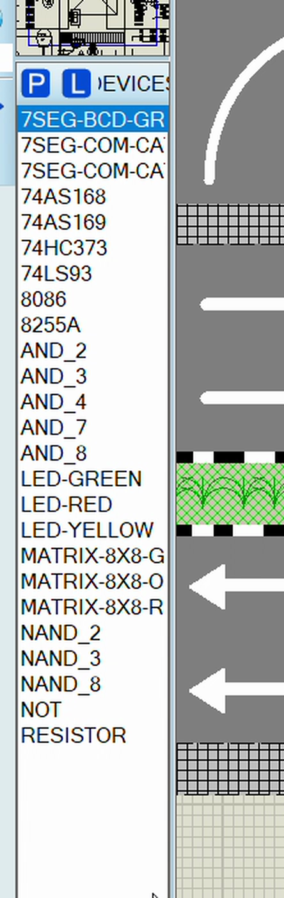
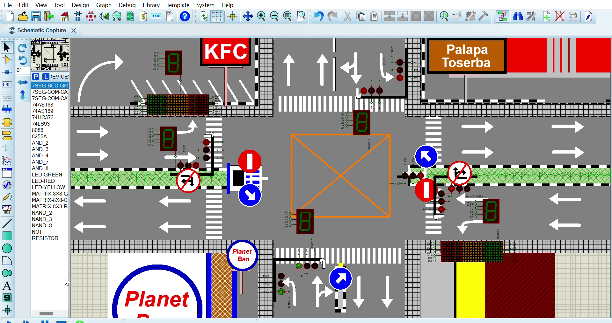

<div align="center">

# 🚦 Traffic Light Control System

### Intel 8086 Microprocessor &nbsp;·&nbsp; 8255A PPI &nbsp;·&nbsp; Proteus Simulation

A three-way traffic light controller built on the **Intel 8086** microprocessor, featuring a **7-segment countdown timer** and an **8×8 dot-matrix** directional indicator — fully simulated in **Proteus**.


</div>

---

## 🧰 Tech Stack

| Layer | Technology |
| :--- | :--- |
| **Processor** | Intel 8086 (16-bit) — three independent units |
| **I/O Interface** | 8255A Programmable Peripheral Interface (PPI) |
| **Glue Logic** | 74LS373 octal latch · 74LS93 binary counter · AND / NAND / NOT gates |
| **Output Devices** | 7-segment displays · 8×8 LED dot matrix (G/O/R) · discrete R/Y/G LEDs |
| **Firmware Language** | 8086 Assembly (emu8086 syntax) |
| **Assembler** | emu8086 |
| **Simulation** | Proteus Design Suite 8 |

---

## 📖 About

This project implements a **three-way traffic light control system** as a hardware–software co-design exercise for the *Computer Architecture (Arsitektur Komputer)* course.

The system is driven by **three Intel 8086 microprocessors**, each running a dedicated firmware routine and interfacing with its peripherals through an **8255A PPI**. Together they reproduce a realistic intersection:

1. **Traffic light sequencing** — a continuous green → yellow → red cycle across three approaches (*Kutai*, *Adityawarman*, and *Sutos*).
2. **7-segment countdown timer** — a per-phase countdown displayed on 7-segment displays.
3. **8×8 dot-matrix indicator** — an animated directional arrow that guides traffic flow.

Everything is verified end-to-end in Proteus, from the assembled `.bin` firmware to the on-screen light and display behaviour.

---

## ✨ Features

- 🚥 **Three-way signal sequencing** — synchronized green → yellow → red transitions per approach.
- ⏱️ **Countdown timer** — 7-segment displays counting down the remaining phase time.
- ➡️ **Dot-matrix direction arrow** — an animated 8×8 LED matrix that indicates the active flow direction.
- 🧩 **Modular firmware** — one self-contained assembly program per subsystem, so each 8086 can be tested independently.
- 🔌 **Port expansion via 8255A** — clean separation between control logic and output ports.
- 🖥️ **Full Proteus simulation** — schematic, wiring, and firmware integrated in a single project file.

---

## 🗂️ Repository Structure

```
.
├── 123PROJEKT-COBA.pdsprj          # Proteus project (final design)
├── 1ABC(PROJECT) versi cepat.asm   # Firmware — traffic light sequencing
├── matrix kanan (project).asm      # Firmware — 8×8 dot-matrix arrow
├── 7-seg-projk.asm                 # Firmware — 7-segment countdown
├── docs/
│   ├── simulation.png              # Proteus simulation preview
│   └── components.png              # Component / IC library used
└── README.md
```

> **Note:** The compiled `.bin` files are **not** included — they are generated by emu8086 from the `.asm` sources (see *Installation*).

---

## 🔌 Hardware & Components

The design is built from the following devices (as listed in the Proteus device library):

| Component | Role |
| :--- | :--- |
| **Intel 8086** | Main microprocessor (one per subsystem) |
| **8255A PPI** | 24-line programmable parallel I/O |
| **74LS373** | Octal latch — address/data bus demultiplexing |
| **74LS93** | 4-bit binary counter |
| **7-Segment Display** | Numeric countdown output |
| **8×8 Dot Matrix (G/O/R)** | Directional arrow indicator |
| **LED (Red / Yellow / Green)** | Traffic light lamps |
| **Logic gates (AND / NAND / NOT)** & **Resistors** | Address decoding, glue logic, current limiting |

<div align="center">
  
  <br>
  <sub><i>Component list as shown in the Proteus device library.</i></sub>
</div>

---

## 🖥️ Simulation Output

<div align="center">
  
  <br>
  <sub><i>The complete intersection running in Proteus — traffic lights, 7-segment countdown, and dot-matrix indicators active.</i></sub>
</div>

---

## 🚀 Installation & Usage

### Prerequisites

| Software | Purpose |
| :--- | :--- |
| [**emu8086**](https://emu8086-microprocessor-emulator.en.softonic.com/) | Assemble the 8086 firmware into `.bin` files |
| [**Proteus 8**](https://www.labcenter.com/) | Run the circuit simulation |

### Steps

**1. Clone the repository**

```bash
git clone https://github.com/irfansss-03/traffic-light-8086-proteus.git
cd traffic-light-8086-proteus
```

**2. Build the firmware (emu8086)**

Open each source file in emu8086 and click **Compile**:

| Source file | Output binary |
| :--- | :--- |
| `1ABC(PROJECT) versi cepat.asm` | `1ABC(PROJECT) versi cepat.bin` |
| `matrix kanan (project).asm` | `matrix kanan project.bin` |
| `7-seg-projk.asm` | `7-seg-projk.bin` |

> The emulator writes the resulting `.bin` files to the `emu8086\MyBuild\` folder (configurable in emu8086's *Options*).

**3. Open the project in Proteus**

Launch Proteus 8 and open **`123PROJEKT-COBA.pdsprj`**.

**4. Attach each program to its processor**

Double-click each **8086** component → set the **Program File** property to the matching `.bin` from step 2:

```
8086 #1  →  1ABC(PROJECT) versi cepat.bin   (traffic light)
8086 #2  →  matrix kanan project.bin        (dot matrix)
8086 #3  →  7-seg-projk.bin                 (7-segment countdown)
```

**5. Run the simulation**

Press **▶ Run** — the traffic lights, countdown, and dot-matrix arrow will start cycling.

---

## ⚙️ How It Works

Each 8086 controls an **8255A PPI** whose ports are memory-mapped as follows:

| Port | Address | Function |
| :--- | :--- | :--- |
| `PORTA` | `00H` | Output data (LED bar / segment / matrix rows) |
| `PORTB` | `02H` | Output data (yellow lamps / matrix columns) |
| `PORTC` | `04H` | Output data (green lamps) |
| `CTRL`  | `06H` | Control register — `80H` sets all ports as output |

**Traffic light logic** — each approach is activated in turn by writing its bit pattern to `PORTC` (green) and `PORTB` (yellow), while `PORTA` drives the per-second LED bar:

```
Kutai  (green → yellow)  →  Adityawarman (green → yellow)  →  Sutos (green → yellow)  →  repeat
```

**Countdown logic** — the 7-segment firmware writes the segment patterns `8 → 4 → 3 → 2 → 1`, producing a visual countdown for the active phase.

**Dot-matrix logic** — the matrix is scanned row-by-row through `PORTA` while `PORTB` supplies the column data, rendering a right-pointing directional arrow.

---

## 👥 Team

**Kelompok 4 — Class TRI-A**
*Computer Architecture (Arsitektur Komputer)*

---

## 📄 License

Released under the **MIT License**. See [`LICENSE`](LICENSE) for details.

<div align="center"><sub>Built with 🧠 assembly, 🧩 logic gates, and a lot of ☕.</sub></div>
